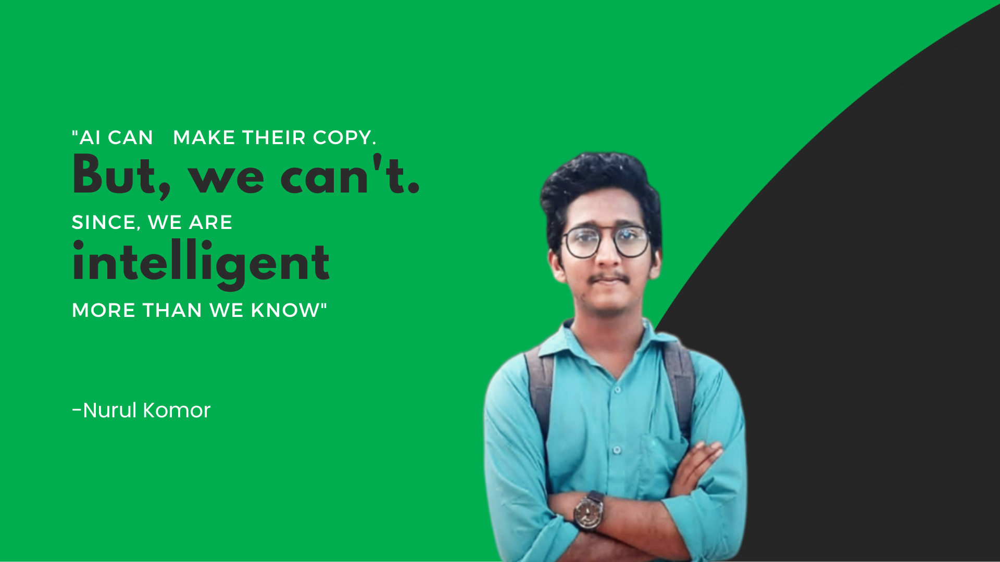

<h1 align="center"> Hi there my gorgeous friends</h1>
<h4 align="center">I'm a Full Stack Web Developer from Bangladesh </h4>

  

- 🔭 I’m currently working on **Electronics shop(E-commerce website )**

- 🌱 I’m currently learning **REACT**

- 👨‍💻 Some of my projects are available at [https://github.com/nurul-komor?tab=repositories](https://github.com/nurul-komor?tab=repositories)

- 💬 Ask me about **Laravel or PHP**

- 📫 How to reach me **nurulkomor52@gmail.com**

- 📄 Know about my experiences [https://drive.google.com/file/d/1HYhs8Xb0QKk1Y4707bZSDlv6QgypsUch/view?usp=sharing](https://drive.google.com/file/d/1M7piYX01gh34tcaAF38p3i18wYtB3ff9/view?usp=drivesdk)

## 🌐 Socials:
  

# 💻 Tech Stack:
          
# 📊 GitHub Stats:
 
 

