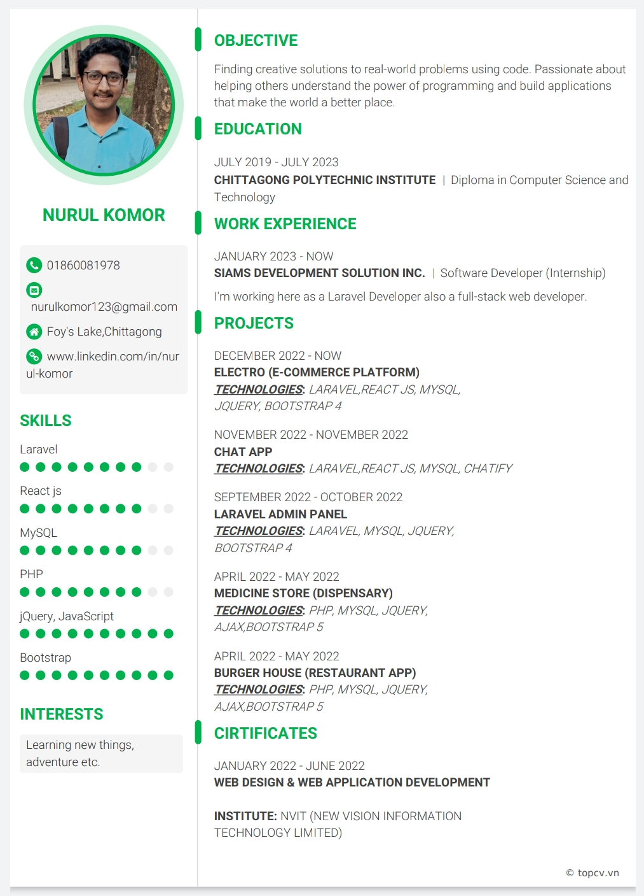

<h1 align="center"> Hi there my gorgeous friends</h1>
<h4 align="center">I'm a Full Stack Web Developer from Bangladesh </h4>

  

- 🔭 I’m currently working on **Card Parking Prject**

- 🌱 I’m currently learning **NextUI**

- 👨‍💻 Some of my projects are available at [https://github.com/nurul-komor?tab=repositories](https://github.com/nurul-komor?tab=repositories)

- 💬 Ask me about **{"Laravel","REACT","PHP","JavaScript"}**

- 📫 How to reach me **nurulkomor123@gmail.com**

<!-- - 📄 Resume  -->

## 🌐 Socials:
  

# 💻 Things I code with:
   
  
  

        

#  📚 Also Familiar With:
         

# 📊 GitHub Stats:
 
 

## 🏆 GitHub Trophies

### ✍️ Random Dev Quote

